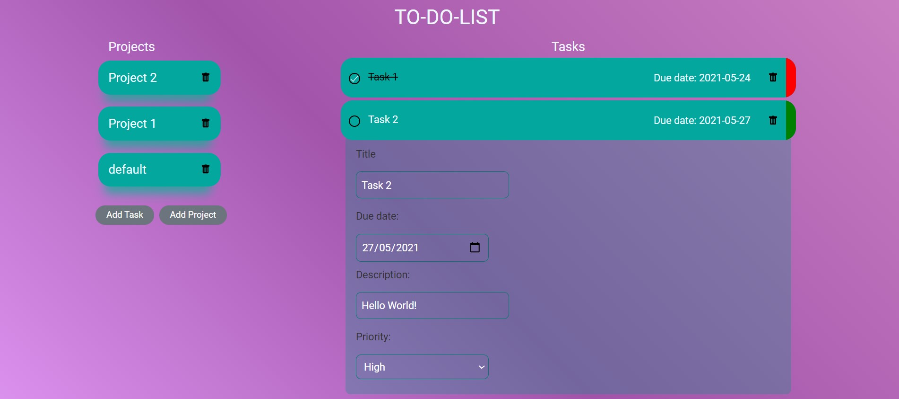

  

<h1 align="center">TO-DO LIST</h1>

  <strong>Made by Jenny Cárdenas</strong>
   
   This is a single page application for a to-do list.

  
   ‎ ‎ ‎ ‎
  

## 👩🏼‍💻 About To-Do List

All page information dynamically generated and component loading achieved using pure Javascript. You can include your to-dos on different projects, edit its details and delete the to-do if you completed it or the whole project.Persistence is with local storage.

## 🔴 Live Demo:

[Check it out](https://raw.githack.com/janis-jenny/ToDo-List/todoApp/dist/index.html)

## 🔧 Built With

- HTML5
- CSS3
- JavaScript ES6
- Webpack
- Linters
- VS Code
- Jest

## 🤖 How it works

To get a local copy up and running follow these simple steps:

1. Go to the [repository page](https://github.com/janis-jenny/To-Do-List).
2. Press the "Code" button and copy the link.
3. Clone it using git command `git clone <you_repository_link>`.
4. Move to the local project: cd `<Your_repository_name>`.
5. Run `npm install` to get all the dependencies.
6. If you want to run the development mode run: `npm run dev`.
7. Run `npm run watch` to run webpack build in watch mode.

## 📏 Running test

1. On the terminal navigate to the project directory using `cd TODO-LIST-JS/`.
2. Run the test with: `npm test`.

## 👥 Author

👤 **Jenny Cárdenas**

- GitHub: [@janis_jenny](https://github.com/janis-jenny)
- Twitter: [@janis_jenny](https://twitter.com/janis_jenny)
- LinkedIn: [Jenny Càrdenas](https://www.linkedin.com/in/paolajenny)

## 🤝 Contributing

Contributions, issues, and feature requests are welcome!

Feel free to check the [issues page](https://github.com/janis-jenny/ToDo-List/issues).

## ⭐ Show your support

Give a ⭐️ if you like this project!

## 📌 Acknowledgments

- [Stack Overflow](https://es.stackoverflow.com/)
- [Microverse](https://www.microverse.org/)
- [Odin Project](https://www.theodinproject.com/paths/full-stack-javascript/courses/javascript/lessons/todo-list)
- Stand up team

## 📝 License

This project is [MIT](https://opensource.org/licenses/MIT) licensed.
